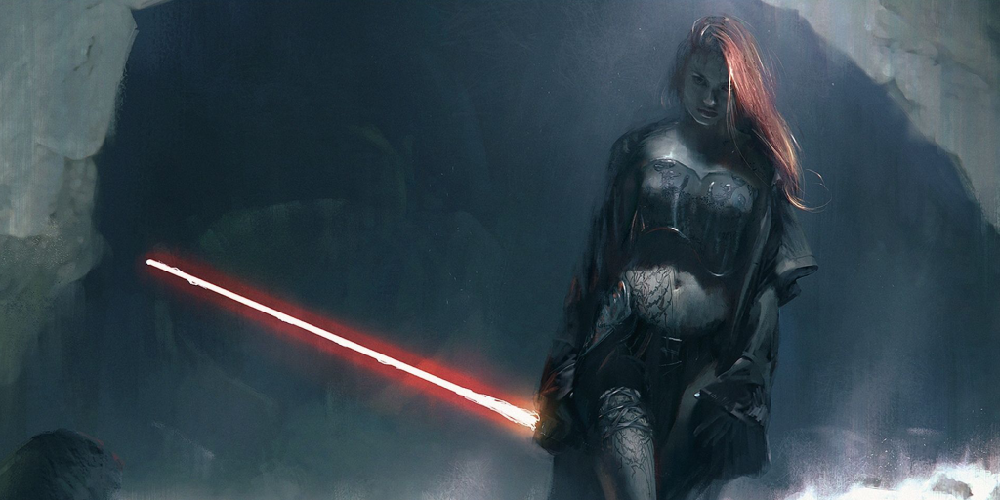
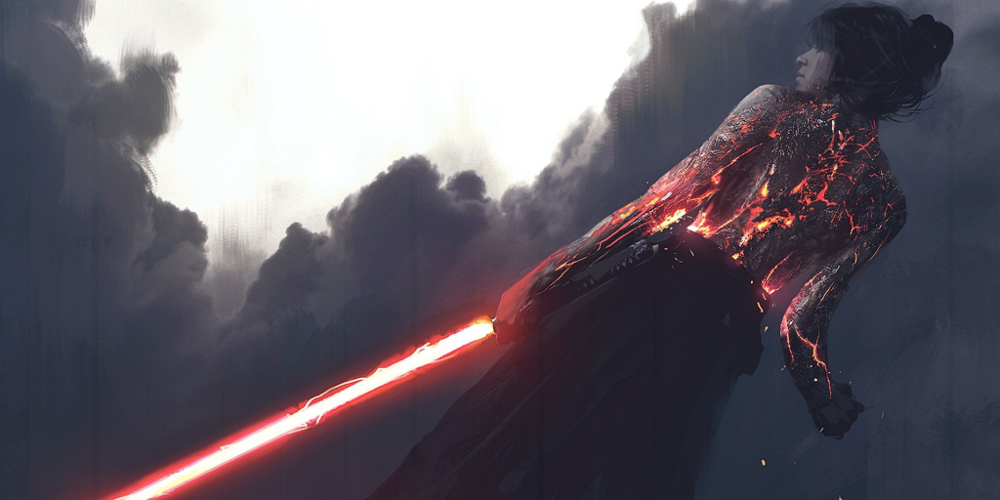
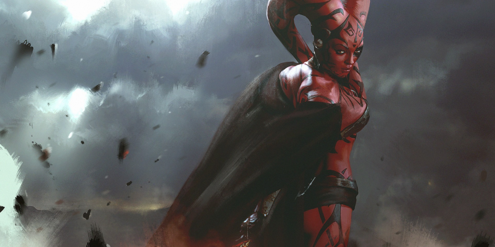

# Information
A simple mod that adds a few posters of some great female Sith artwork.

# Installation
Download the **.package** file of your choice and place in your mod folder. 

# Preview

# Ways To Help
- Contribute new code, or updating whats already here
- Donate for Dr Pepper funds at Venmo @terranbytes
- Join or start a discussion on the discussions tab

# Locura Mods
Locura Mods develops mods for multiple games including Dual Universe, The Sims 4, Farming Simulator 22, Cities: Skylines, and Scrap Mechanic. We also have multiple organizations set up in Dual Universe.

"Locura Mining Co" is a mining only org that also serves as a hub for our LUA code, mining rig sales, and raw ore sales. We also buy all ore. Join today for help and free equipment for mining.

"Locura Property Management" is an organization that rents territories for mining or other uses. Fees are due on a pre-determined basis that fits your play times. Fees are payable in Ore, Quanta, or anything else of value.

You may also VR to our store in Dual universe at "Locura Mining Co".
